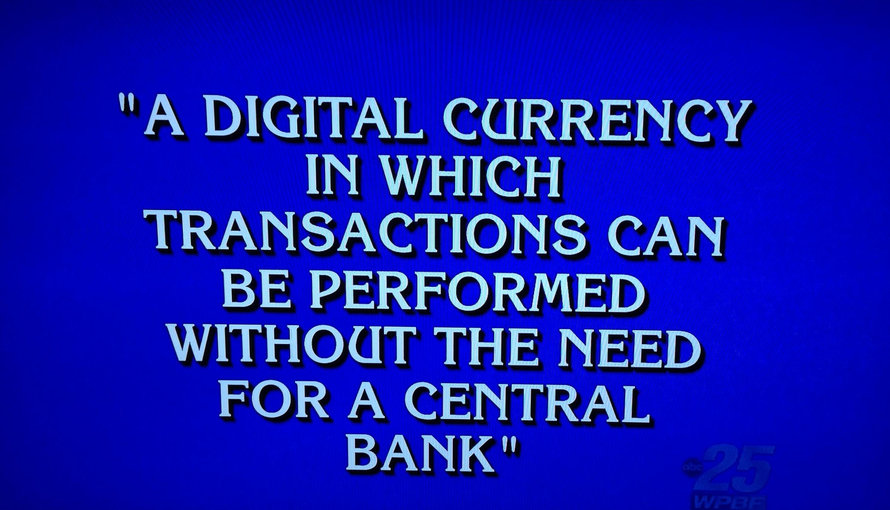
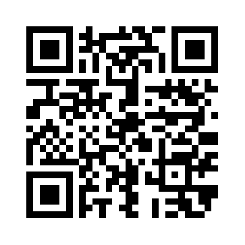

% Bitcoin
% Brian Peck
% February 18, 2013

<!--Image credit: http://i.imgur.com/HH9mqRc.jpg h/t r/bitcoin -->

# What is Bitcoin?

## Cryptocurrency
> - Currency
> - Peer-to-peer payment network
> - Buy and sell things

------

<!--Image credit: http://bitcoinity.org/markets -->

# How to use Bitcoin?

## Wallet
> - May contains multiple addresses
> - Address is public 'key' to your account

------

<!-- Image credit: Generated at wolframalpha.com -->

Key: 5KPgEXqb7FGSgCSF9iZhGHHzAFPFXzfg2uhA8rN7kS4Pt3UJhFA

## Sending Money
> - Send money to someone's public address
> - Verify with your private key

# Cryptography Primer

## Public Key Cryptography
> - Pairs of keys: Private (sign) and Public (verify)
> - Chosen together with various mathematical properties

---------
<!--Image credit: https://www.switch.ch/export/sites/default/uni/projects/grid/download_repository/crypto3.png-->

## Cryptographic Hash Function
> - One-way function (hard to reverse)
> - Input: Arbitrary Block of Data
> - Output: Fixed-size bit string

# How it works

## Block Chain
> - Log of every transaction
> - Publicly available [(blockchain.info)](http://www.blockchain.info)

## Making a Transaction
> - X creates message "X pays Y 5 BTC"; signs it with private key
> - X broadcasts message to peer-to-peer network
> - Y can see transaction, verify that X sent it, and has the money
> - Unverified transaction - needs to be added to block chain

## Verifying a block
> - 'Miners' independently verify all network transactions
> - `hash("block"nonce) = XXXXXXX`
> - Maintains network integrity

# Okay, so what?

## Enable Micro transactions

## UX Design
